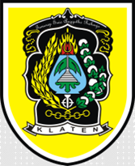

# SojiwanBot : Otomatisasi Surat Desa dengan WhatsApp Bot & Web

 <!-- Logo project -->

**SojiwanBot** adalah sebuah project yang menggabungkan **WhatsApp Bot** dengan **Website** untuk menghasilkan surat-surat resmi desa, seperti surat pengantar dan surat keterangan belum menikah. Project ini bertujuan untuk memudahkan warga desa dalam mengajukan dan mengelola surat-surat penting secara digital.

---

## 🚀 Fitur

Berikut adalah fitur-fitur utama yang tersedia dalam project ini:

- **WhatsApp Bot**: Warga dapat mengajukan permohonan surat melalui WhatsApp.
- **Website Display**: Admin dapat melihat dan mengelola permohonan surat melalui website.
- **Otomatisasi Surat**: Surat-surat resmi dapat dihasilkan secara otomatis berdasarkan data yang diinput.

---

## 🛠️ Teknologi yang Digunakan

Berikut adalah teknologi yang digunakan dalam pengembangan project ini:

- **Node.js**: Untuk menjalankan aplikasi backend.
- **Express.js**: Framework untuk membuat API.
- **MySQL**: Database untuk menyimpan data.
- **EJS**: Template engine untuk membuat tampilan HTML.
- **Baileys**: Library untuk membuat WhatsApp Bot.

---

## 🖥️ Cara Instalasi

Berikut adalah langkah-langkah untuk menjalankan project ini di komputer lokal Anda:

1. **Clone repository**:
   ```bash
   git clone https://github.com/SiAnakAlim/Project-KKN.git
   cd Project-KKN
   ```
2. **Install dependencies**:

     ```bash
    npm install
     ```

3. **Setup Database**:

Buat database MySQL dengan nama surat_desa.

Import file SQL dengan nama surat_desa

4. **Konfigurasi environment**:

Buat file .env di root folder dan isi dengan konfigurasi berikut:

  ```bash
  DB_HOST=localhost
  DB_USER=root
  DB_PASSWORD=
  DB_DATABASE=surat_desa
```
5. **Jalankan Aplikasi**:

Untuk menjalankan WhatsApp Bot:

```bash
cd wa-bot
node index.js
```
Untuk menjalankan website display:
```bash
cd web-display-node
node app.js
```
6. **Akses aplikasi**:

WhatsApp Bot: Scan QR code yang muncul di terminal.

Website Display: Buka browser dan akses http://localhost:3001.

*pastikan xampp bagian apache dan mysql dalam kondisi start

---

## 🤝 Kontribusi
Jika Anda ingin berkontribusi pada project ini, silakan ikuti langkah-langkah berikut:

Fork repository ini.

Buat branch baru (git checkout -b fitur-baru).

Commit perubahan Anda (git commit -m 'Menambahkan fitur baru').

Push ke branch (git push origin fitur-baru).

Buat Pull Request.

---

## 📞 Kontak
Jika Anda memiliki pertanyaan atau masukan, silakan hubungi:

Nama: Aryamukti Satria Hendrayana

Email: aryamuktisatria@gmail.com

---

### **Cara Menggunakan**
1. Copy-paste kode di atas ke dalam file baru bernama `README.md`.
2. Simpan file tersebut di root folder repository GitHub Anda (`Project-KKN`).
3. Commit dan push file `README.md` ke GitHub:
   ```bash
   git add README.md
   git commit -m "Menambahkan README.md"
   git push origin master

